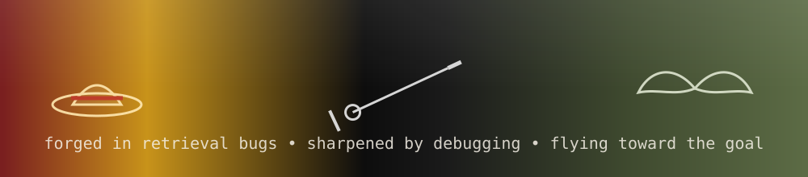

<h1>Yogeshwaran D</h1>

## 💫 About Me

- 🎓 Final-year **AI & Data Science** student, SNS College of Engineering
- 🔭 Currently building a **multi-stage RAG pipeline** — hybrid search (BM25 + dense retrieval), multi-query & HyDE expansion, parent-document retrieval, and cross-encoder reranking
- 🤖 Deep into **LangChain / LangGraph** — building self-improving agent systems that synthesize their own tools and self-critique failures
- 🧪 Fine-tuned **Mistral-7B / Qwen2.5-7B** with QLoRA (HuggingFace `peft`, `trl`, `bitsandbytes`)
- 🧠 Comfortable across the LLM stack: **ChromaDB, FAISS, Qdrant, Groq, HuggingFace embeddings (BAAI/bge-m3), LangSmith**
- 📈 Prepping **DSA + system design** to go with the ML depth — targeting top AI/LLM engineering roles
- ⚡ Fun fact: I'd rather understand *why* the retriever failed than paste a fix — no vibe coding

## 🛠️ Tech Stack

**Languages & Core**

**LLM / RAG / Agents**

**ML / DL**

**Vector Stores & Retrieval**

**Tools**

## 📊 GitHub Stats

## 🐍 Contribution Snake

> ⚠️ The snake needs a one-time GitHub Action setup in this repo — see `snake.yml` below.

### ✍️ Random Dev Quote

## 🌐 Connect With Me

